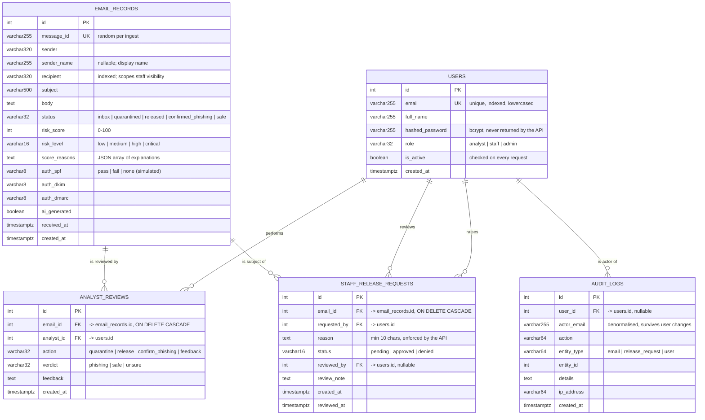

# PhishGuard — Data Model / ERD

Five tables. Definitive DDL: [`database/schema.sql`](../database/schema.sql).
ORM definitions: [`backend/app/models.py`](../backend/app/models.py).

---

## Entity-relationship diagram

---

## Relationships

| From | To | Cardinality | Meaning |
|---|---|---|---|
| `users` → `analyst_reviews` | `analyst_id` | 1 : N | One analyst performs many reviews |
| `users` → `staff_release_requests` | `requested_by` | 1 : N | One staff member raises many requests |
| `users` → `staff_release_requests` | `reviewed_by` | 1 : N | One analyst decides many requests (nullable until decided) |
| `users` → `audit_logs` | `user_id` | 1 : N | One user is the actor of many events |
| `email_records` → `analyst_reviews` | `email_id` | 1 : N | One email accumulates many reviews |
| `email_records` → `staff_release_requests` | `email_id` | 1 : N | One email may be the subject of several requests over time |

`staff_release_requests` has **two** foreign keys into `users`, which is why the
ORM relationships in `models.py` declare `foreign_keys=` explicitly.

---

## Indexes

Defined in `database/schema.sql` and mirrored by the ORM:

| Table | Index | Why |
|---|---|---|
| `users` | `email` (unique) | Login lookup on every authentication |
| `email_records` | `message_id` (unique) | Prevents duplicate ingestion |
| `email_records` | `status` | The inbox filters on status |
| `email_records` | `recipient` | Staff visibility scoping runs on every list request |
| `analyst_reviews` | `email_id`, `analyst_id` | Review history lookups |
| `staff_release_requests` | `status`, `requested_by` | The pending queue and the duplicate-request check |
| `audit_logs` | `action`, `created_at`, `user_id` | The audit view filters by action and sorts by time |

---

## Integrity rules

**Enforced by the database**

- `users.email` and `email_records.message_id` are unique.
- All foreign keys are declared; deleting an email cascades to its reviews and
  release requests, so no orphan rows remain.
- `NOT NULL` on every column the application always populates.
- `VARCHAR(n)` widths bound every text column except `body`, `details`,
  `reason`, `review_note`, `feedback` and `score_reasons` (all `TEXT`).

**Enforced by the API** (`schemas.py` + the routers)

- Input length constraints mirror the column widths, so an over-long value is a
  422 rather than a database error. See `docs/BUG_LOG.md`, BUG-03.
- `sender` and `recipient` must be syntactically valid addresses and are
  lowercased before storage.
- A release request requires a reason of at least 10 characters.
- A release request is only valid against an email whose status is
  `quarantined` or `confirmed_phishing`.
- At most one *pending* release request per (email, user) pair.
- A decided request cannot be decided again (409).
- An analyst action that would not change the status is rejected (409), so no
  duplicate review or audit row is written for a state change that never
  happened.

**Now also enforced by the database** (added after BUG-13)

- `CHECK` constraints restrict `users.role`, `email_records.status`,
  `email_records.risk_level` and the three authentication-result columns to their
  documented values, and bound `risk_score` to 0–100.
- A `CHECK` on `staff_release_requests` requires a decided request to record its
  reviewer and timestamp, and a pending one not to.
- A **partial unique index** on `(email_id, requested_by) WHERE status =
  'pending'` makes "at most one open request per user per email" atomic, so two
  concurrent submissions cannot both succeed.

The permitted values are declared once as constants in `backend/app/models.py`,
so the ORM, `database/schema.sql` and the tests cannot drift apart.

**Still not enforced**

- The columns are `VARCHAR` with `CHECK` constraints rather than PostgreSQL
  `ENUM` types. That is a deliberate trade-off: `CHECK` constraints work
  identically on SQLite, so the automated suite exercises the same rules the
  assessed database applies. Moving to native enumerated types is future work.
